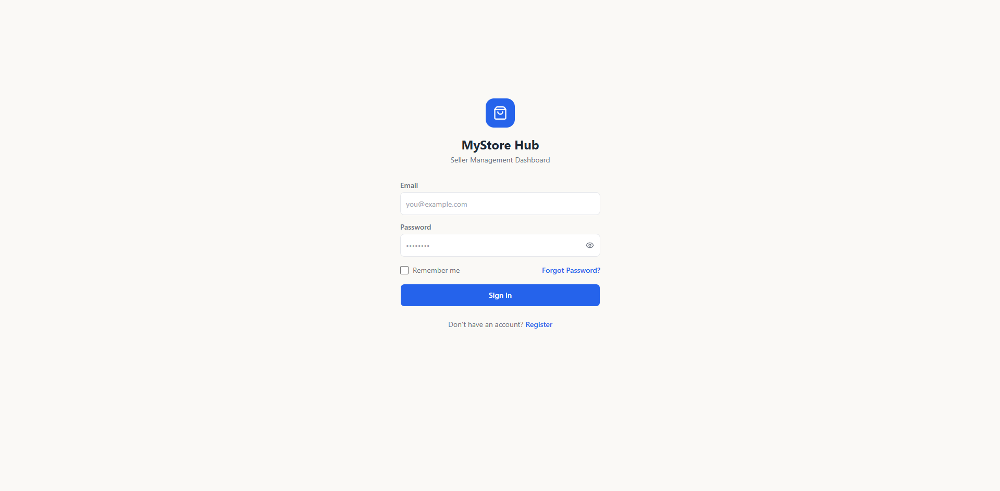
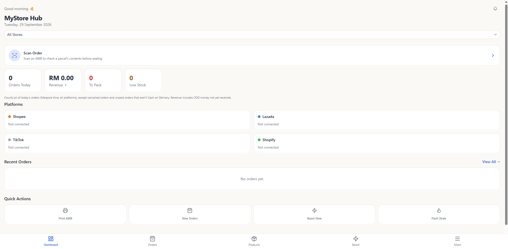
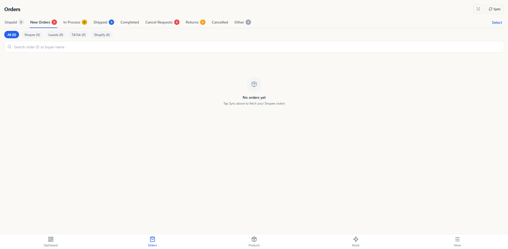
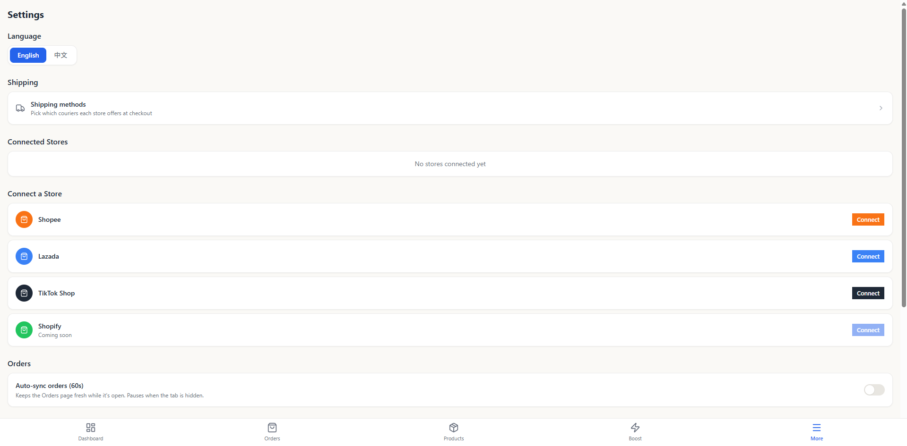

# MyStore Hub

A mobile-first, multi-platform e-commerce seller dashboard — built to replace a paid SaaS tool for managing 7 live stores across Shopee, TikTok Shop and Lazada.

Orders, shipping labels, flash deals, product boosts and sales reporting in one place, in English and 简体中文.

<p align="center">
  
  
</p>

---

## Why I built this

I run a small toy business selling on Shopee, TikTok Shop and Lazada. Managing 7 storefronts meant logging into 7 separate seller centres every day, and the third-party tool that solved it cost a monthly fee for features I only half-used.

So I built my own. It now handles the full daily workflow: syncing orders, arranging shipment, printing air waybills, and tracking sales — from a phone, while standing at a packing table.

This is a real production system with real customers' orders flowing through it, not a tutorial project.

---

## Features

### Order management
- **Unified inbox** across Shopee, TikTok Shop and Lazada, with per-platform status vocabularies mapped into one consistent set of tabs
- **Arrange shipment** (pack) individually or in bulk, with pickup/dropoff resolved per order from the platform's own shipping parameters
- **Buyer cancellation handling** — approve or reject cancellation requests inside a 48-hour response window
- **Auto-pack** (opt-in, per store) — automatically arranges shipment for eligible orders on a schedule

<p align="center">
  
  
</p>

### Shipping labels (AWB)
- **Single and bulk printing**, grouped by store and courier (platforms refuse to batch labels across logistics channels)
- **Background prefetch** so labels are ready before you ask for them
- **Native "Open with" chooser** on Android, so labels open straight into a thermal printer app
- **Scan to check order** — point the camera at a waybill barcode to see the parcel's contents before sealing it


### Marketing
- **Flash deal monitoring** — live, upcoming and ended sessions with promo prices, quotas and countdowns
- **Copy flash deals** into multiple future time slots in one action, with per-slot verification
- **Product boost rotation** — automatically re-boosts products as their 4-hour boost windows expire

### Reporting
- **Dashboard** — today's orders and revenue, bucketed by payment date in Malaysian time
- **30-day sales report** — per store and combined, server-side aggregated

### Platform
- **Push notifications** for new orders and cancellation requests
- **Full internationalisation** — English and Simplified Chinese across 13 pages
- **Android app** via Capacitor, with native file handling and session persistence
- **Automatic background sync** every 5 minutes across all connected stores

---

## Tech stack

| Layer | Technology |
|---|---|
| Frontend | React, Vite, Tailwind CSS, shadcn/ui |
| Backend | Vercel Serverless Functions |
| Database | Supabase (PostgreSQL, Row Level Security) |
| Auth | Supabase Auth |
| Mobile | Capacitor (Android) |
| Scheduling | External cron → serverless sync endpoint |
| Integrations | Shopee Open API v2, TikTok Shop API, Lazada Open Platform |

---

## Architecture

```
┌─────────────┐     ┌──────────────────┐     ┌─────────────┐
│  React PWA  │────▶│ Vercel Functions │────▶│  Shopee /   │
│  + Android  │     │      /api        │     │  TikTok /   │
│    (APK)    │◀────│                  │◀────│   Lazada    │
└─────────────┘     └────────┬─────────┘     └─────────────┘
       │                     │
       │                     ▼
       │            ┌──────────────────┐
       └───────────▶│    Supabase      │
                    │ Postgres + RLS   │
                    └──────────────────┘
                             ▲
                    ┌────────┴─────────┐
                    │  Cron (5 min)    │
                    │  sync-all        │
                    └──────────────────┘
```

Each store's sync runs in parallel with its own time budget, bounded by the serverless function's execution limit. Every sync writes a start row and a completion row, so a hard platform timeout — which leaves no exception to catch — is still detectable afterwards.

---

## Engineering notes

A few problems that were more interesting than expected:

**Silent truncation.** PostgREST caps an unbounded `select` at 1000 rows with no error. The orders page filtered client-side over that truncated array, so 244 real orders were unreachable through any tab, search or filter — with nothing in the logs. Fixed with a paging helper that reports when it hits a ceiling, plus server-side aggregation for anything that only needs totals.

**Success-but-empty.** A recurring class of bug where an API returns HTTP 200 with less than you asked for: a payment timestamp of `0` stored as null, a write endpoint returning an empty body with no per-item verdict, a read endpoint reporting stale counts for two minutes after a confirmed write. The fix is structural — never infer success from a response, always verify by reading back the thing you changed.

**Invisible timeouts.** A platform-level function timeout doesn't run your `catch` block. One store failed every sync for a month, leaving partial data and zero log rows. Now every sync writes a "started" row up front, so a started-but-never-completed row is itself the signal.

**Concurrent writes.** Two overlapping sync paths each deleted the other's freshly-inserted order items, leaving orders with zero items. Replaced with a Postgres function doing delete-then-insert in one transaction.

---

## Running locally

```bash
git clone https://github.com/Chuahbingsong/MyStoreHub.git
cd MyStoreHub
npm install
```

Create `.env.local`:

```
VITE_SUPABASE_URL=your-supabase-url
VITE_SUPABASE_ANON_KEY=your-anon-key
```

Apply the database schema from `supabase/` in your Supabase SQL editor, in order:

1. `schema.sql`
2. `rls.sql`
3. the feature migrations

Then:

```bash
npm run dev
```

> **Note:** This app integrates with live seller platform APIs. Running it fully requires approved developer accounts on Shopee Open Platform, TikTok Shop Partner Center and Lazada Open Platform, plus connected stores.

---

## Status

Actively used in production for a real business. Built and maintained solo.
